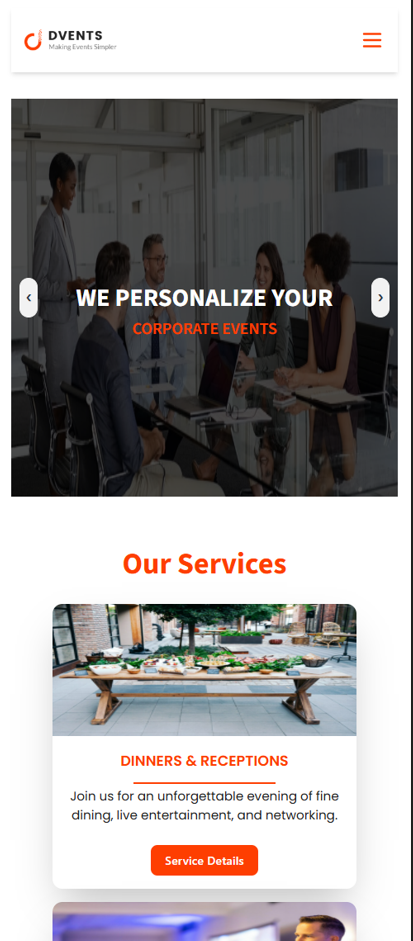

# Dvents - Corporate Event Solutions


## 💡 Project Overview

Dvents is a corporate event planning and management solution designed to provide seamless event services for businesses. This web app offers user authentication, secure private routes, dynamic content, and a fully responsive design for an optimal experience across devices.

---

## 🚀 Key Features

- ✅ **Dynamic Navbar:** Adaptive navigation menu with active link highlighting.
- ✅ **Service Showcase:** Dynamic sections that display corporate event services interactively.
- ✅ **Firebase Authentication:** Secure sign-up and login with Google OAuth and email/password methods.
- ✅ **Protected Routes:** Access control ensuring only authenticated users can view private pages.
- ✅ **Responsive Design:** Mobile, tablet, and desktop-friendly layout that adapts flawlessly.
- ✅ **Animated UI:** Smooth animations powered by AOS library for enhanced user experience.
- ✅ **Real-time Contact Functionality:** Contact form submissions are delivered instantly to the event team’s inbox.
- ✅ **Live Resume Sharing:** Job seekers or collaborators can submit their resume directly from the platform.
- ✅ **Functional Booking System:** Authenticated users can initiate service bookings through a real email-based submission system.

---

## 🖼️ Screenshots

### 💻 Desktop Version


### 📱 Mobile Version



---

## ⚙️ Technologies Used

- ✅ React.js with React Router DOM
- ✅ CSS & Tailwind CSS for styling
- ✅ Firebase Authentication and Firestore for user management and data storage
- ✅ AOS (Animate On Scroll) for scroll-based animations
- ✅ SweetAlert for interactive alert modals
- ✅ Lightweight JS-based backend logic for booking and contact functionality

---

## 🛠️ Installation & Setup

1. Clone the repository:

   ```bash
   git clone https://github.com/sabbir-noyon/project-corporate-solution.git
   ```

2. Navigate into the project directory:

   ```bash
   cd project-corporate-solution
   ```

3. Install dependencies:

   ```bash
   npm install
   ```

4. Create a Firebase project and update `.env` with your Firebase config keys.

5. Run the development server:

   ```bash
   npm start
   ```

---

## 🔍 Usage

- Visit the live demo to explore the full functionality.
- Register or log in using email/password or Google OAuth.
- Explore services and make bookings on authenticated private routes.

---

## 🔮 Future Improvements

- Add advanced event booking features with payment integration.
- Improve admin dashboard for event management.
- Add multi-language support.

---

## 📄 License

This project is licensed under the MIT License.

---

🤝 Thank you for visiting!
